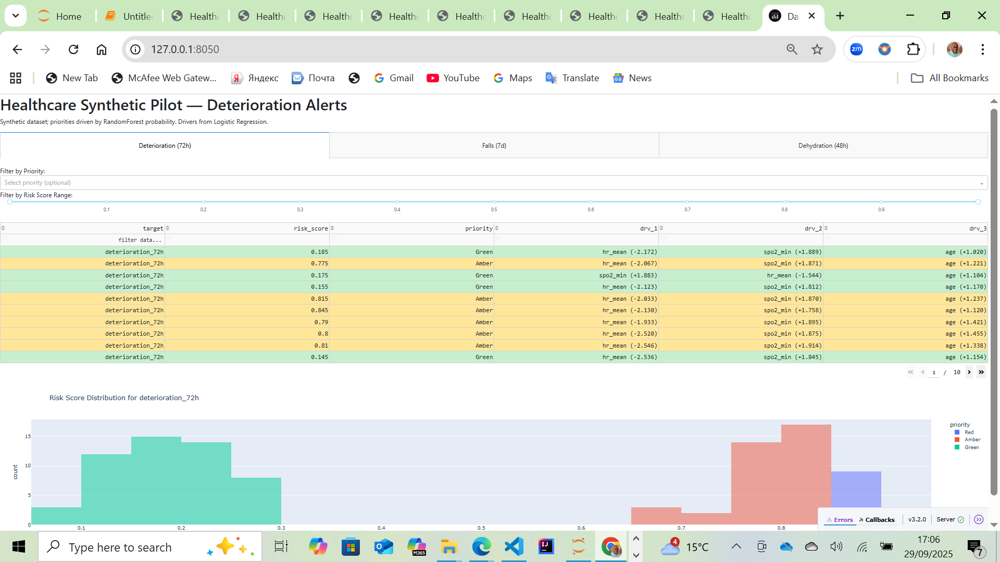

# Healthcare Synthetic Pilot (Stage 0)  
[](https://www.python.org/) 
[](LICENSE)  

A Stage 0 **Synthetic Data Pilot** for a healthcare risk-alert system.  
This project generates synthetic healthcare data, trains baseline ML models, produces risk alerts, and builds dashboards (static + interactive).  

---

## 📂 Project Structure
- **data/**
  - `synthetic_dataset.csv` → synthetic patient records  
- **src/**
  - `generate_synthetic_data.py` → data generation  
  - `train_baseline.py` → model training (RandomForest + Logistic Regression)  
  - `explain_and_alerts.py` → risk alerts & explainability  
  - `build_static_dashboard.py` → static HTML dashboard  
  - `app.py` → interactive Dash app  
- **artifacts/** → saved models (.pkl) and metrics  
- **reports/** → evaluation metrics, alerts, dashboards  
- **notebooks/** → optional end-to-end Jupyter notebook  

---

## 🚀 Quick Start

### 1. Create a Python environment
**Option A: Conda**
```
python -m venv .venv
# Windows
.venv\Scripts\activate
# macOS/Linux
source .venv/bin/activate
```


**Option B: venv**
```
python -m venv .venv
# Windows
.venv\Scripts\activate
# macOS/Linux
source .venv/bin/activate
```


### 2. Install dependencies
```

pip install -r requirements.txt
```


### 3. Run the pipeline
```

python src/generate_synthetic_data.py
python src/train_baseline.py
python src/explain_and_alerts.py
python src/build_static_dashboard.py
```


### 4. Explore outputs

reports/metrics.json → model metrics (AUROC, AUPRC, precision, recall, F1)

reports/alerts.csv → combined alerts (deterioration, falls, dehydration)

reports/dashboard.html → static dashboard (open in browser)

Run python src/app.py → interactive dashboard at http://127.0.0.1:8050

### 📊 Sample Dashboard




### 🧠 Models

RandomForest → risk scoring (probabilities)

Logistic Regression → explainability (top drivers)

### Alert thresholds:

🔴 Red: ≥ 0.85

🟠 Amber: ≥ 0.60

🟢 Green: otherwise

### 📝 Notes

Data is synthetic, for demonstration purposes only

Thresholds configurable in src/explain_and_alerts.py

Dashboard supports filtering & sorting

### 📜 License

This project is licensed under the MIT License — see the LICENSE
 file.
